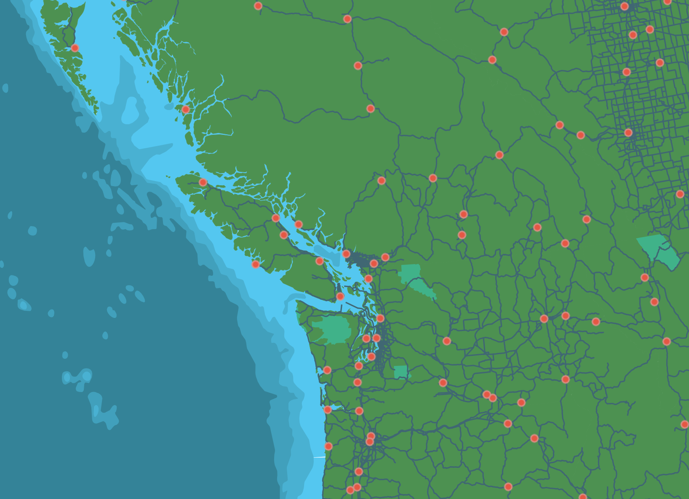
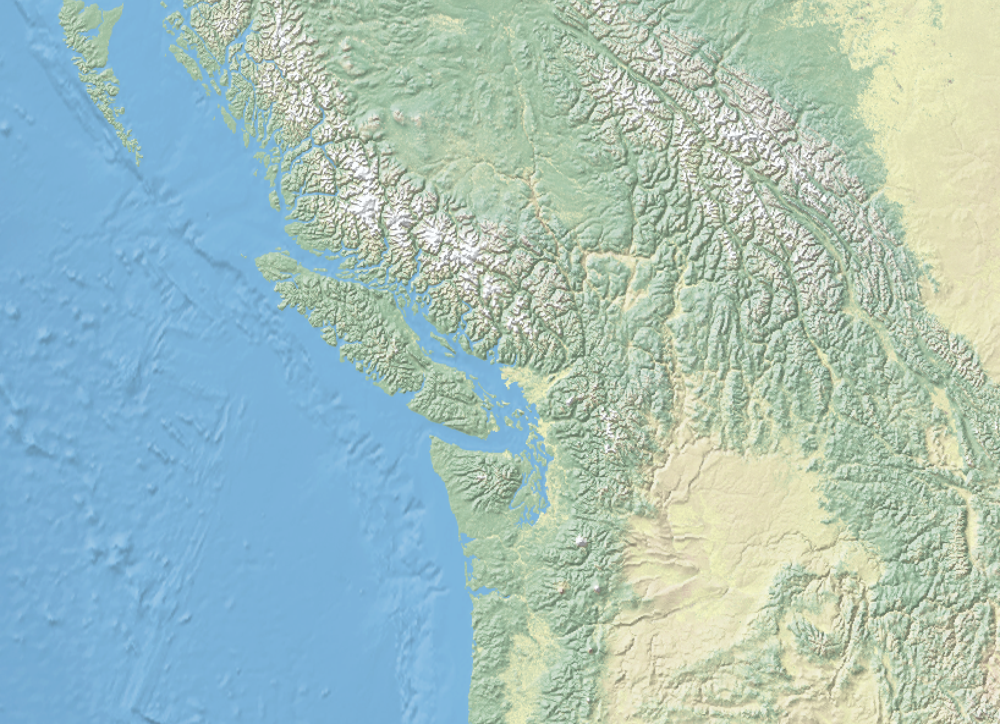

# Geospatial Introduction
Geospatial data, or simply 'spatial data', is data that is spatially referenced to Earth using location information – most commonly geographic coordinates. A Geographic Information System, or *GIS*, uses this location information to project a geospatial file into a virtual geographic space where it can then be visualized and analyzed.

## Raster vs. Vector 
Geospatial data is often referred to as having two main types: **raster** and **vector**. **Raster data** is data which is made up of pixels arranged in a grid, whereas **vector data** is made up of vertices and the paths between them – creating geometries that represent real-world features or phenomena. In other words, a vector data layer will be made up of either points, lines, or polygons.


<br>

<br>
<!-- 
Tabular data are data formatted into a table by rows and columns. The attribute table of a shapefile is an example of tabular data. You can also add a tabular dataset, such as a .csv (commma separated value) file, directly to a GIS and A) join it with a shapefile based on a matching column, or B) project it given coordinate pairs are present. -->


## Formatting
If you’re a GIS user, you have likely encountered a shapefile before. Shapefiles are the industry standard file type for geographic vector data. A shapefile stores data in binary (0s and 1s, not text), so you wouldn’t be able to read the file with human eyes. GeoJSON on the other hand, is a geospatial file type meant for the web. GeoJSON is “easy for humans to read, and easy for machines to read”, meaning it’s a lightweight, simplified format your average web browser can use. And, they’re also fairly easy to understand if you want to view and edit them in a code editor. Here’s the geoJSON for a point over UBC:

```js
{
      "type": "Feature",
      "properties": {
        "name": "The University of British Columbia"
      },
      "geometry": {
        "type": "Point",
        "coordinates": [
          -123.25012207031249,
          49.26186749272789
        ]
      }
    }
```


Raster data are often stored as `.tif` or `.tiff` files. Today's workshop will focus on vector data. 

Reminder/review of formats used so far in this workshop