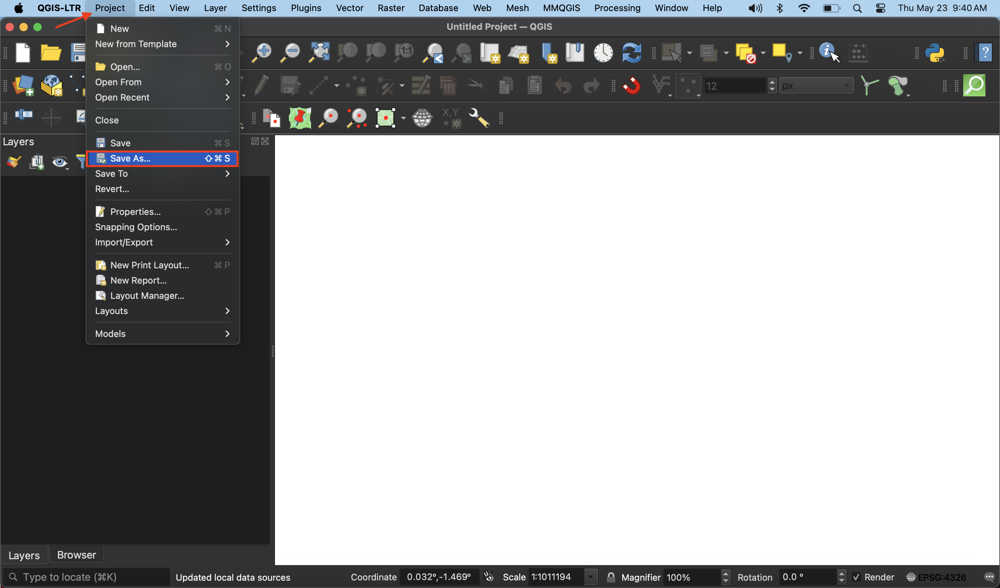

## QGIS Project Setup & Interface Tour

### Open & Save a new QGIS project
After downloading and installing QGIS-LTR, launch the QGIS application from your computer. When the application opens, it will look something like the image below. Double click “New Empty Project” to open a new QGIS project.

To save your project, navigate to the Project Menu at the stop of your screen and go down to “Save As”. Save the project to a location (like the        `r-qgis-workshop` folder) and give it a name such as `r-qgis-workshop_FirstnameLastname`. It’s best practice to save your QGIS projects to the folder where you keep your data for the project. You’ll notice the file extension is `.qgz`.

### Navigate the Graphical User Interface (GUI)

 

> **Toolbars** - Toolbars are where you will find the most useful geoprocessing, editing, navigation, and other tools. You can customize this area of your GUI to fit your needs.
> **Browser and Layers Panel** - The browser panel lets you easily navigate your file system for data and project files. Your layers panel displays your project’s data layers and provides access to configuration settings. Show and Hide Panels by going to the “View” Menu at the top of your screen and going down to the Panels or Toolbars submenu. Alternatively, you can right-click (control-click) any of the blank space on the Toolbar to see what Tools and Panels are currently active.
> **Status Bar** - The status bar displays current information about the map canvas, and allows you to make adjustments in the map’s scale and rotation.
> **Map Canvas or Map View** - Call it either one. This is where the map is displayed as layers are loaded. You can zoom/pan the map canvas as well as select features and other operations.

## Project properties and interface preferences 

add from https://ubc-library-rc.github.io/gis-tools-workflows/content/project-setup.html

