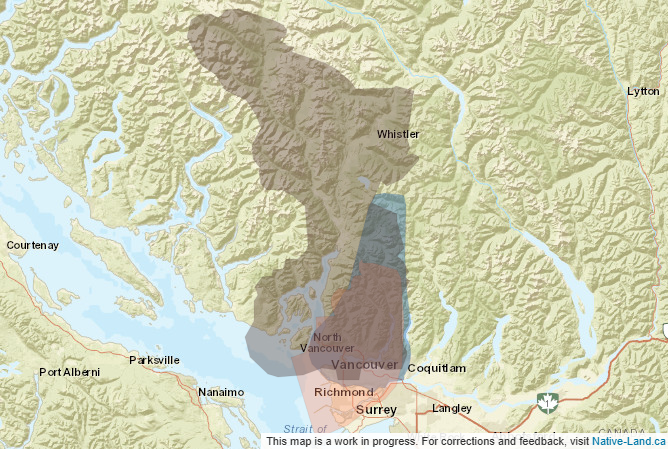

# Land acknowledgement

Before beginning the workshop, we'd like to acknowledge the Indigenous lands where we are located. The UBC Vancouver campus is located on the traditional, ancestral, and unceded territory of the xʷməθkʷəy̓əm (Musqueam), səlilwətaɬ (Tsleil-Waututh), and Skwxwú7mesh-ulh Temíx̱w (Squamish) peoples.

This map is from <em>Native Land Digital</em>. Please take a moment to explore [native-land.ca](https://native-land.ca/) and learn about the Indigenous territories, languages, and treaties in your area.

<iframe src="https://native-land.ca/api/embed/embed.html?maps=territories&position=49.244770894278666, -123.16698232306474&key=AADlPNbKCBAepz816odRT" style="width:100%; height:400px; border:none;"></iframe>
